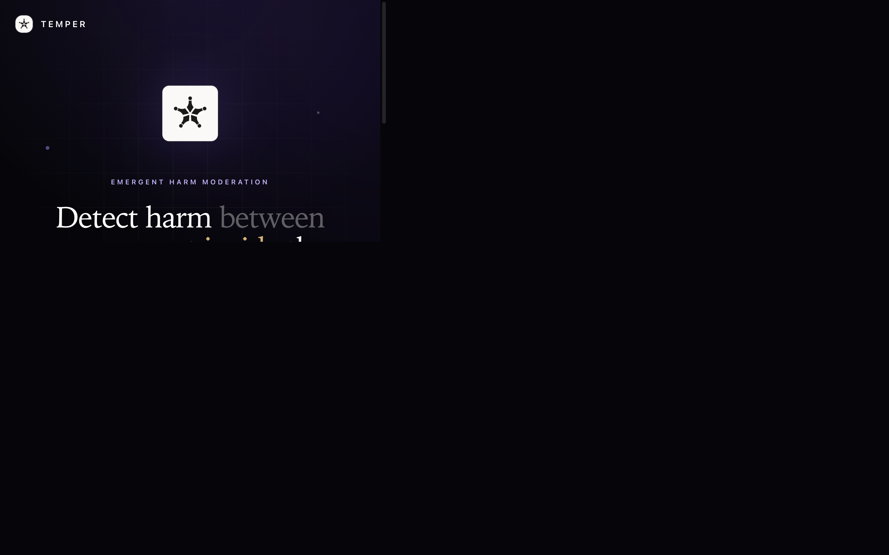
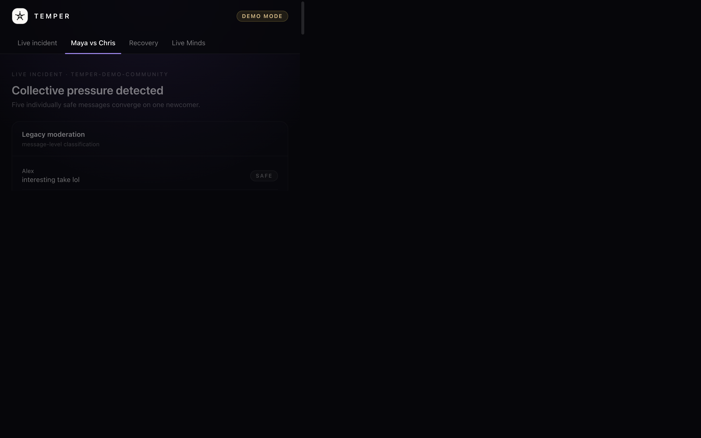
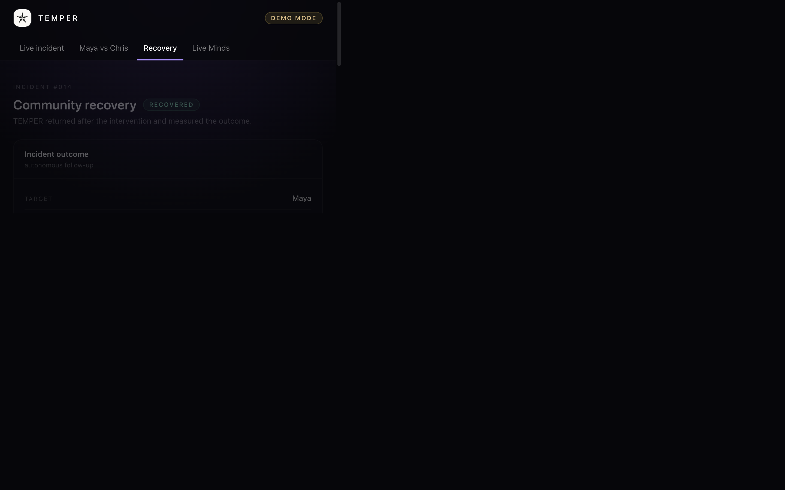

<p align="center">
  
</p>

<h1 align="center">TEMPER</h1>

<p align="center">
  <b>Detect harm between messages, not inside them.</b><br />
  <i>Emergent Harm Moderation powered by persistent community memory.</i>
</p>

<p align="center">
  Telegram &nbsp;·&nbsp; Minds by Animoca Brands &nbsp;·&nbsp; Next.js &nbsp;·&nbsp; SQLite
</p>

---

TEMPER is a **persistent moderation Mind** for creator communities. It detects
**emergent harm** — harmful social behaviour that does not exist inside any
single message, but emerges across multiple interactions over time.

---

## The problem

Five safe messages can still form one harmful interaction.

A traditional moderation system evaluates messages **independently**:

```
SAFE  SAFE  SAFE  SAFE  SAFE
```

But when five different members direct those same five messages at one newcomer
within ninety seconds, the collective interaction is a **dogpile** — even though
no individual message violates a rule.

## The insight

Moderation systems evaluate **messages**.
Communities operate through **relationships**.

Harm can emerge from *who is targeting whom, how fast, and whether they have a
history* — not from what any single message contains.

## What TEMPER does

TEMPER combines deterministic interaction structure with **persistent community
memory (Minds)** to:

1. **Detect** when multiple members converge on one target — a structural signal.
2. **Interpret** whether that convergence is friendly banter or collective
   pressure — a persistent Mind decision.
3. **Intervene proportionally** — for the MVP, a single gentle group redirect.
4. **Return later** to measure whether the target re-engaged.
5. **Learn** from the outcome, so the next decision is better.

## The proof

> **Same words. Same pattern. Different history.**

| | **Maya** | **Chris** |
| --- | --- | --- |
| Messages | identical | identical |
| Convergence | 5 → 1 | 5 → 1 |
| Legacy verdict | SAFE | SAFE |
| Tenure | 2 days | 8 months |
| Relationship history | none | extensive |
| **TEMPER verdict** | **DOGPILE** | **BANTER** |
| Action | redirect | none |

Maya and Chris receive the *exact same five messages* from the *exact same five
members*. TEMPER returns opposite decisions because a persistent Mind remembers
different histories.

## How it works

```
Observer → Convergence → Mind → Decision → Intervention → Incident → Follow-up → Memory
```

The full system architecture, data model, decision loop and incident lifecycle —
with diagrams — live in **[`docs/ARCHITECTURE.md`](docs/ARCHITECTURE.md)**.

## Live demo

The dashboard has four views:

| View | What it shows |
| --- | --- |
| **Live incident** | Legacy feed (all `SAFE`), the 5 → 1 convergence graph, TEMPER verdict |
| **Maya vs Chris** | The central contrast, side by side |
| **Recovery** | Incident outcome + seeded demo metrics |
| **Live Minds** | Run a real analysis against the live Mind and read its persistent history |

The golden path runs offline via a deterministic, clearly-labelled evaluator so
the demo never depends on random LLM behaviour. Set `DEMO_MODE=false` and a
Builder API key to run it against **real Minds**.

## Screenshots

**Landing**



**Live incident** — legacy feed (all `SAFE`), the 5 → 1 convergence graph, TEMPER verdict


**Maya vs Chris** — the central contrast



**Recovery** — incident outcome



**Live Minds** — real Minds analysis + persistent history


## Tech stack

- **TypeScript** · **Node.js 22+** · **Next.js (App Router)** · **Tailwind CSS**
- **Minds** — `@animocabrands/minds-client-lib` (persistent Mind + conversation)
- **Telegram** — grammY (observer + intervention)
- **SQLite** — Node's built-in `node:sqlite` (deterministic app state)
- **framer-motion** — dashboard animations

## Getting started

Requirements: **Node.js 22+**.

```bash
npm install
cp .env.example .env        # DEMO_MODE=true by default
npm run seed                # seed the controlled demo dataset
npm run dev                 # http://localhost:3000
```

To run the **real Minds** flow, edit `.env`:

```bash
DEMO_MODE=false
MINDS_BUILDER_API_KEY=<your-builder-api-key>
TEMPER_MIND_ID=<your-mind-id>
TELEGRAM_BOT_TOKEN=<your-bot-token>   # optional, for the live observer
```

## Scripts

| Command | Purpose |
| --- | --- |
| `npm run dev` | Start the development server |
| `npm run build` | Production build |
| `npm run start` | Start the production server |
| `npm run seed` | Seed the demo dataset into SQLite |
| `npm run followup` | Run autonomous follow-up on open incidents |
| `npm run contrast` | Run the live Maya/Chris contrast on real Minds |
| `npm run bot` | Run the Telegram observer (long polling) |
| `npm run scenario` | Run the golden-path dogpile scenario end-to-end |
| `npm test` | Run the test suite (convergence, Minds evaluator, follow-up) |

## Telegram

Set `TELEGRAM_BOT_TOKEN`, then run `npm run bot`. Add the bot to a group and
grant message-read permission. When members reply to or mention the same target,
TEMPER turns those into interaction events; at `>=5` unique sources within the
convergence window the engine emits a signal and — if the Mind returns a dogpile
— the bot posts a **gentle group redirect**. For production, point Telegram's
webhook at `/api/telegram`.

## Configuration

| Variable | Purpose |
| --- | --- |
| `DEMO_MODE` | `true` = offline deterministic evaluator · `false` = real Minds |
| `MINDS_BUILDER_API_KEY` | Builder API key (the official client connects automatically — no URL) |
| `TEMPER_MIND_ID` | The selected Mind id |
| `DEMO_COMMUNITY_ID` | Stable conversation alias (default `temper-demo-community`) |
| `TELEGRAM_BOT_TOKEN` | Telegram bot token (enables the observer) |
| `TELEGRAM_WEBHOOK_SECRET` | Optional secret for the `/api/telegram` webhook |
| `DATABASE_URL` | SQLite path (default `file:./temper.db`) |

When Minds is unavailable at runtime, TEMPER returns **OBSERVE** and never
intervenes — it never fabricates a verdict.

## MVP scope

The hackathon MVP implements exactly **one** emergent-harm pattern — **dogpile
detection** — and nothing else. No bans, no toxicity scores, no keyword filters.
See [`Temper.PRD`](Temper.PRD) for the locked scope and explicit non-goals.

## Documentation

- **[`docs/ARCHITECTURE.md`](docs/ARCHITECTURE.md)** — system architecture, data
  model, decision loop and incident lifecycle (with diagrams).
- **[`Temper.PRD`](Temper.PRD)** — the locked product requirements document.

## Structure

```
app/            Next.js App Router pages + API routes
components/     Dashboard (4 views) + shared UI
lib/
  minds/        Minds client, prompts, schema, deterministic evaluator, contrast
  telegram/     observer, handler, interventions
  convergence/  detector + config
  incidents/    service, follow-up
  db/           SQLite client + schema
  demo/         seeded demo dataset
scripts/        seed, follow-up, contrast, bot runners
docs/           architecture documentation
```
