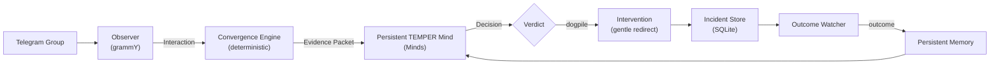
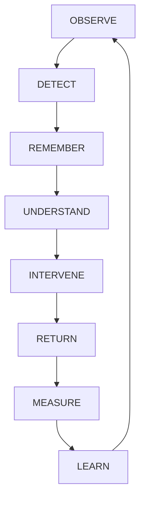
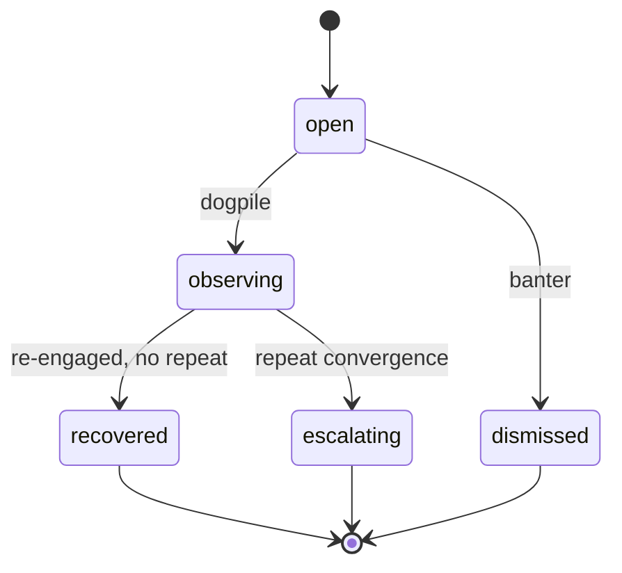

# TEMPER — Architecture

TEMPER is a persistent moderation Mind for creator communities. This document
describes the runtime architecture, the decision loop, the data model and the
incident lifecycle.

## Overview

TEMPER separates **deterministic signal detection** from **persistent meaning**.
Plain application code detects *structure* (who converged on whom, how fast); a
persistent Mind decides *what it means* (banter vs. pressure). Memory is not an
attachment — it changes the decision.



## Separation of concerns

### Deterministic signal layer

Plain application code detects **structure** — never meaning:

- how many unique users replied to the same target
- within what time window
- whether the pattern is accelerating

It answers *"something unusual may be happening"*.

### Persistent meaning layer

The TEMPER Mind interprets the signal against historical context:

- target tenure and prior exchanges
- reciprocity and established banter
- comparable precedents and past disengagement
- which interventions worked before

Without this context the system cannot distinguish the Maya scenario from the
Chris scenario — which makes Minds part of the core decision engine, not an
attachment.

## Decision loop



## Data flow

```
Telegram group
      │ messages / replies
      ▼
Observer (lib/telegram/observer.ts)
      │ Interaction { source, target, timestamp, type }
      ▼
ConvergenceEngine (lib/convergence/detector.ts)
      │ ConvergenceSignal  (>=5 unique sources → 1 target, <=120s)
      ▼
EvidencePacket (lib/types.ts)
      ▼
TemperMind (lib/minds/client.ts)
      │ MindDecision { verdict, confidence, reason, action, followUpMinutes }
      ▼
Decision
   ├─ DOGPILE  → create Incident (open) → gentle redirect → OBSERVING
   ├─ BANTER   → create Incident → dismissed
   └─ OBSERVE  → create Incident → observing
      ▼
Incident Store (lib/incidents/service.ts, SQLite)
      ▼
Outcome Watcher (lib/incidents/follow-up.ts)
      │ RECOVERED / ESCALATING / OBSERVING
      ▼
Memory (Minds) — rememberOutcome()
```

## Convergence detection

Deterministic and configurable:

| Parameter | Default | Env override |
| --- | --- | --- |
| minimum unique sources | `5` | `CONVERGENCE_MIN_SOURCES` |
| window | `120s` | `CONVERGENCE_WINDOW_SECONDS` |

Repeated source members count once — we care about distinct members converging.
The detector emits a signal only; the verdict is the Mind's responsibility.

## Decision contract

The Mind must return structured JSON (validated with Zod in
`lib/minds/schema.ts`):

```json
{
  "verdict": "dogpile",
  "confidence": 0.91,
  "reason": "The target is a two-day-old member with no established relationship history with the five converging members.",
  "action": "gentle_group_redirect",
  "follow_up_minutes": 180
}
```

The parser extracts the first `{…}` block from the reply, so wrappers like
`<pre>` tags or markdown fences are tolerated. An invalid or unavailable
response is never treated as a verdict.

## Minds modes

| Mode | Trigger | Behaviour |
| --- | --- | --- |
| `minds` | `DEMO_MODE=false` + `MINDS_BUILDER_API_KEY` set | Official `@animocabrands/minds-client-lib` (`ensureConversation`, `sendMessage`, `waitForReply`, `getHistory`) |
| `deterministic-demo` | `DEMO_MODE=true` | Offline evaluator encoding the Maya/Chris rules |
| `unavailable` | neither | Returns `OBSERVE`; never intervenes |

The `source` field is surfaced to the UI so the demo never fabricates a real
Minds verdict.

### Persistence proof

All incidents for one community share a stable alias
(`temper-demo-community`) and one Mind (`TEMPER_MIND_ID`). `ensureConversation`
is idempotent, so the same alias always resolves to the same persistent
conversation. `GET /api/minds/history` returns that conversation's history —
the same-alias → same-Mind → persistent-history proof.

For the live Maya/Chris contrast, seed two aliases (`temper-maya` and
`temper-chris`) with different context, then submit identical evidence.

## Storage

SQLite (Node's built-in `node:sqlite`) stores deterministic application state:

- `members` — tenure, message counts
- `interactions` — reply/mention edges
- `convergence_signals` — raw structural events
- `incidents` — lifecycle state
- `incident_outcomes` — follow-up results

Minds remains the source of persistent **semantic** community context.

## Incident lifecycle



An incident stays open after intervention. The follow-up runner
(`npm run followup`) evaluates re-engagement, repeat convergence and escalation,
then persists the outcome and records it back into the Mind.

## Deterministic evaluator rules

The offline evaluator (`lib/minds/deterministic.ts`) encodes the PRD's
integration tests:

| Condition | Verdict |
| --- | --- |
| tenure ≤ 7 days, ≤ 2 exchanges, 0 banter cases | `dogpile` |
| tenure ≥ 30 days, ≥ 10 exchanges, ≥ 1 banter case | `banter` |
| anything else | `observe` |

## API surface

| Route | Purpose |
| --- | --- |
| `POST /api/analyze` | Submit an evidence packet → Mind decision |
| `GET /api/minds/history` | Persistent conversation history (persistence proof) |
| `GET` / `POST /api/incidents` | List / create incidents |
| `GET` / `PATCH /api/incidents/[id]` | Read / update an incident |
| `POST /api/telegram` | Telegram webhook |
| `POST /api/demo/seed` | Seed the demo dataset |

## Live loop

```
Telegram group → observer → convergence → Mind → intervention → incident → follow-up → memory
```

The observer (`lib/telegram/observer.ts`) converts replies/mentions into
interaction events. The engine (`lib/engine.ts`) drives the loop end-to-end;
`npm run bot` runs it via long polling, and `/api/telegram` exposes it as a
webhook.

## Failure handling

- **Minds unavailable** → `OBSERVE` only, no intervention.
- **Telegram delivery fails** → intervention stays pending, surfaced in the
  dashboard, never falsely marked as sent.
- **Insufficient history** → `OBSERVE`.
